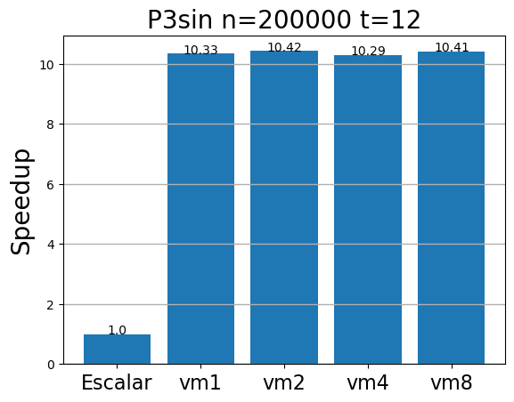

## Optimization of the sine Taylor Series through Loop Unrolling and Interleaving

### 1. Intro

The objective of this project is to optimize the calculation of the sine of a 32-bit floating-point data array using the polynomial approximation of the Taylor series. The core of the algorithm requires iteratively calculating odd powers and accumulated factorials using the mathematical relationship: $T_{n}=\frac{−x2}{(2n) (2n+1)}T_{n-1}$ In a direct scalar or vector implementation, this loop exhibits a very strict Read-After-Write **(RAW)** data dependency: the calculation of the current term ($T_{n}$) cannot begin until the instruction for the previous term ($T_{n−1}$) has completed its execution cycle. In modern processors with segmented pipelines and out-of-order execution, such as the Spacemit X60 core, this causes massive stalls in the FPU due to the physical latency of the multiplication instruction.

* Test Platform: Banana Pi BPI-F3 with **Spacemit K1** processor, 64-bit RISC-V architecture with 256 bits Vector Extension 1.0.

* Dataset Configuration: $N=200,000$ elements, $Terms=12$ terms of the sine Taylor series.

By analyzing the compiler's behavior with the flags ```-fopt-info-vec-optimized``` and ```-fopt-info-vec-missed```, we can see how the compiler behaves when attempting to vectorize the loop:

```bash
gcc -O3 -march=rv64gcv -fopt-info-vec-optimized -fopt-info-vec-missed P3sin.c -o P3sin
P3sin.c:26:14: missed: couldn't vectorize loop
P3sin.c:26:14: missed: not vectorized: unsupported control flow in loop.
P3sin.c:33:16: missed: couldn't vectorize loop
P3sin.c:35:26: missed: not vectorized: unsupported use in stmt.
P3sin.c:92:14: optimized: loop vectorized using variable length vectors
```
The only loop the compiler has been able to optimize is the data initialization loop, but it has not been able to vectorize any of the loops that perform the Taylor series calculation.Starting from this baseline, we will conduct a study of manual vectorization, varying the length of the vectorization to examine performance.

### 2. First attempt: using intrinsic functions with a variable LMUL



The use of vector intrinsics improves performance by about 10 times compared to code optimized with the ```-O3``` flag. However, the value of LMUL does not affect performance; this is mainly due to two factors:

* The RAW dependencies between multiplication operations.
* The vector processing unit (VPU) dedicated to multiplication can process, in a single cycle, only an amount of data equivalent to $\frac{VMAX}{SEW}$, that is, $8$ floats. 

### 3. Optimization Strategy: Unrolling and Interleaving

To mitigate the RAW latency bottleneck, a loop unrolling and instruction interleaving technique was implemented. Instead of processing a single vector block sequentially, the algorithm was restructured to handle four independent blocks simultaneously using vectors with a base register multiplier (LMUL=1).

**Load Phase**: Four consecutive reads are performed from memory ```__riscv_vle32```, offset by the size of the physical vector (vl_max), initializing four accumulators and four independent terms in separate registers (logical registers v0 through v15).

Computational Interleaving (Latency Hiding): In Taylor's inner loop, multiplication instructions are cross-interleaved. When the instruction from Block 0 is issued and held in the pipeline waiting for its operands to become ready, the out-of-order processor takes advantage of the hardware’s free lanes to immediately issue the instructions from Blocks 1, 2, and 3.

**Residue Robustness**: To avoid numerical errors or out-of-range violations at the end of the array, the code was divided into two phases: a fast, optimized loop that processes only exact multiples of the combined size of the 4 blocks (4×vlmax), and a sequential vector cleanup loop for the remaining elements (0 to 31 elements).

### 4. Experimental Results and Performance Metrics

The following table presents the data collected using the Linux performance profiler (perf stat), comparing the base scalar version, flat vector configurations with different LMUL factors, and the optimized version with interleaving


| Métrica / Contador Hardware | Scalar | Vectorial `LMUL=1` | Vectorial `LMUL=8` | Vectorial `UNROLLED` (4 Blocks) |
| :--- | :--- | :--- | :--- | :--- |
| **Compute Time (s)** | 0.038544 | 0.003781 | 0.003716 | 0.001793 |
| **Speedup** | *Base (1×)* | 10.19× | 10.29× | **21.50×** |
| **Cycles** | 618,358,817 | 562,723,696 | 563,694,396 | **561,792,198** |
| **instructions Executed** | 682,836,561 | 651,398,990 | 651,141,794 | **650,552,004** |
| **IPC** | 1.10 | 1.16 | 1.16 | **1.16** |
| **L1-DCache Misses** | 0.11% | 0.12% | 0.13% | **0.13%** |
| **Total Elapsed Time (s)** | 0.464794 | 0.419387 | 0.431193 | **0.429963** |


### 5. Performance Analysis and Conclusions

Analysis of the hardware counters reveals critical insights into the microarchitecture of the Spacemit K1:

**The LMUL Glass Ceiling:** In flat vector tests, increasing the LMUL parameter from 1 to 8 did not result in any improvement in computation time (0.0037s vs 0.0036s). This demonstrates that the algorithm’s bottleneck was not caused by the size of the vector register or bandwidth, but rather by the internal latency of sequential execution.

**The Success of Interleaving:** The unrolled version reduced the computation time to 0.001857 seconds, achieving a speedup of about 2× compared to standard vectorization and 21.50× compared to the original scalar code.

**The Global Counters Paradox**: When looking at global perf metrics, the process’s total cycles and instructions remain virtually flat. This is because perf stat measures the entire lifecycle of the executable, including the heavy overhead of operating system calls and memory allocation. Pure computation time is cut in half, but the remaining time is dominated almost entirely by the sequential initialization of data in RAM and the rest of the program’s computation.

In conclusion, the instruction interleaving technique exploiting independent intrinsic variables has proven to be an effective strategy for saturating vector functional units, maximizing instruction-level parallelism (ILP) in advanced RISC-V architectures. 
