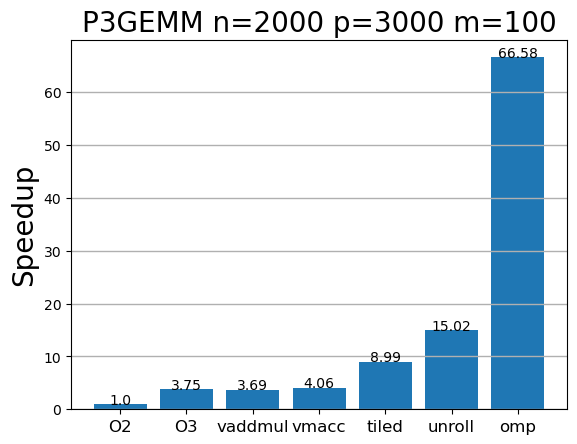

## GEMM Optimization with RISC-V RVV 1.0

This repository contains the analysis and progressive optimisation of a generic matrix multiplication algorithm (**GEMM**) for large matrices ($2000 \times 3000 \times 100$), running natively on a **64-bit RISC-V** architecture utilising the ** RVV 1.0** vector extension and advanced cache locality techniques (*Tiling*).

The repository develops the algorithm through various stages:
* **`GEMM_O2.c`**: Pure scalar code.
* **`GEMM_O3.c`**: code vectorised by the compiler using the `-O3` flag.
* **`GEMM_vaddmul.c`**: First vector approach using `vle32.v`, `vfmul.vf`, `vfadd.vv`.
* **`GEMM_vmacc.c`**: Latency reduction by replacing the Mul/Add pair with the combined instruction `vfmacc.vf`.
* **`GEMM_tiled.c`**: Implementation of *Loop Nest Blocking* (Tiling) by dividing the spatial problem into submatrices that fit into the L1 cache, eliminating *stores* with strides to RAM.

## Benchmark Results

The experiment was carried out on a **Banana BPI-F3** SBC (with a RISC-V architecture processor), measuring the pure computation time required to calculate the resulting matrix $C$:

```bash
perf stat -e cycles,instructions,branches,branch-misses,L1-dcache-loads,L1-dcache-load-misses,L1-dcache-stores,L1-dcache-store-misses ./P3GEMM_version 2000 3000 100
```

| Metric  | `GEMM_O2` (Base) | `GEMM_O3`  | `GEMM_vaddmul` | `GEMM_vmacc`  | `GEMM_tiled` |
| :--- | :---: | :---: | :---: | :---: | :---: |
| **Computing Time** | 2.881 s | 0.812 s | 0.776 s | 0.708 s | **0.319 s** |
| **CPU Cycles (`cycles`)** | 5.484 M | 2.177 M | 2.138 M | 2.010 M | **1.389 M** |
| **Instructions** | 5.412 M | 1.562 M | 793 M | 782 M | **675 M** |
| **IPC (`insn per cycle`)** | **0.99** | 0.72 | 0.37 | 0.39 | 0.49 |
| **L1 Loads (`loads`)** | 1.949 M | 466 M | 574 M | 574 M | **361 M** |
| **L1 Load Misses** |  **1.955.513** | 1.877.319 | 2.044.323 | 2.036.231 | 2.479.215 |
| **L1 Stores (`stores`)** | 689 M | 244 M | 280 M | 280 M | **91 M** |
| **L1 Store Misses** | 568 K | 553 K | 550 K | 550 K | **546 K** |


 

> **Key takeaway:** Maximum optimisation is not achieved simply by inserting vector instructions, but by managing how data flows between RAM, L1 cache blocks and the silicon’s vector ALUs.


* **Overall acceleration:** the tiled version achieves an 88.9% reduction in computation time (down from 2.881 s to 0.319 s) compared to the base _O2 version.
* **Instruction reduction:** Manual vector optimisation (**_vaddmul** and **_vmacc**) and block-based optimisation (_tiled) significantly reduce the total number of instructions compared to automatic vectorisation **_O3**. This is because the compiler is very conservative in its application, and uses an LMUL of 1 to avoid excessive pressure on registers. This can be examined in the assembly code generated by the compiler:
```asm
  90 0082 D7F7060D 		vsetvli	a5,a3,e32,m1,ta,ma                 # LMUL=1
  91              		.loc 1 20 8 is_stmt 1
  92              		.loc 1 20 22 is_stmt 0
  93 0086 87600502 		vle32.v	v1,0(a0)
  94 008a 93952700 		slli	a1,a5,2
  95              		.loc 1 20 40
  96 008e 07610602 		vle32.v	v2,0(a2)
  19:P3GEMM.c      ****         	for (j = 0; j < m; j++) 
  97              		.loc 1 19 24 discriminator 1
  98 0092 9D8E     		sub	a3,a3,a5
  99 0094 2E95     		add	a0,a0,a1
 100 0096 2E96     		add	a2,a2,a1
 101              		.loc 1 20 26
 102 0098 D79021B2 		vfmacc.vv	v1,v3,v2                       #Uses vmacc
 103              		.loc 1 20 16
 104 009c A7600702 		vse32.v	v1,0(a4)
```
* **The misleading IPC of _O2:** Although **_O2** has the highest IPC (0.99), it is inefficient; the processor runs fast but only executes scalar instructions.
* **Efficient operation fusion:** The _vmacc version reduces the number of instructions compared to _vaddmul (from 793M to 782M), demonstrating that the multiply and accumulate operations are fused into a single CPU cycle.
* **Store Loads traffic: _tiled** reduces L1 cache writes from 689 million to 91 million (a reduction of 86.7%), confirming that partial sums are retained in the registers before being written to memory.
* **Data bus independence:** _tiled reduces L1 reads (loads) to one-fifth of the base version, preventing the CPU from suffering from data starvation and raising its actual IPC to 0.49.
* **Consistency of mandatory failures:** Write failures (store-misses) remain constant (~550 K) across all versions because they correspond to the mandatory initialisation of the array.
---

### Tile Scaling Analysis and L1 Cache Behaviour

The Banana Pi features a **32 KB L1 data cache** and operates with 32-bit floating-point precision (4 bytes per element). An empirical study was carried out by varying the tile size to find the hardware’s optimal saturation point:

 Tile Size | Computation Time | L1 Loads | L1 Misses | % Misses | L1 Cache Status |
| :---: | :---: | :---: | :---: | :---: | :--- |
| **32 x 32** | 0.712 s | 588,147,925 | 2,267,033 | 0.39% | **Underutilised**|
| **50 x 50** | **0.310 s** | 368,267,051 | 2,762,719 | 0.75% | **Optimal net balance**|
| **64 x 64** | **0.320 s** | 361,152,490 | 2,463,928 | 0.68% | **Alignment optimum**|
| **128 x 128** | 0.452 s | 359,436,762 | 8,375,178 | **2.33%** | **Saturation and Overflow**|


### Compilation

To compile natively in the RISC-V environment using vector support (requires `gcc` with support for RVV 1.0):

```bash
# Compile all versions
make

# Run by entering dimensions: N P M (N x P) (P x M)
./python3 P3GEMM_su 2000 3000 100
```

### Next Steps

* Implement the same algorithm in C++ to measure the impact of zero-cost abstractions on the code.

* Use GEMM to implement a *2D convolution* using the *im2col* algorithm.